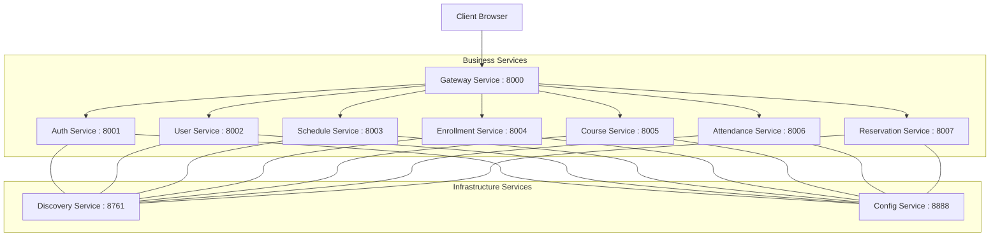

# Schoolmate - 마이크로서비스 기반 학사 관리 시스템

## 🏫 프로젝트 개요
**Schoolmate**는 마이크로서비스 아키텍처(MSA)를 기반으로 구축된 차세대 학사 관리 시스템입니다. 학생, 교사, 관리자가 학사 일정, 수강 신청, 출결 관리, 시설 예약 등을 효율적이고 유연하게 수행할 수 있도록 설계되었습니다.

## 🚀 주요 기능
- **통합 인증 및 보안**: JWT 기반의 무상태(Stateless) 인증과 API Gateway를 통한 중앙 집중형 보안 필터링.
- **수강 신청 시스템**: 장바구니 기능을 포함한 실시간 수강 신청 및 수강 인원 동시성 제어.
- **출결 관리 (Attendance)**: 스마트한 출석 체크, 정정 요청 및 관리자 승인, 학기별 출결 마감 프로세스.
- **학사 일정 및 교과 관리**: 학년도별 학사 일정 관리 및 교과목/상세 강의 정보 제공.
- **시설 예약**: 학교 내 주요 시설(강의실, 체육관 등)의 실시간 예약 현황 조회 및 승인 시스템.
- **유연한 확장성**: 각 도메인별 마이크로서비스 분리를 통해 서비스별 독립적인 배포 및 확장 가능.

## 🏗 시스템 아키텍처

## 🛠 기술 스택
- **Backend Framework**: Spring Boot 3.5.x
- **Microservices**: Spring Cloud (Gateway, Eureka, Config, OpenFeign)
- **Database**: MariaDB
- **Persistence**: Spring Data JPA, MyBatis (도메인별 최적화된 활용)
- **Security**: Spring Security, JWT (Json Web Token)
- **API Documentation**: SpringDoc OpenAPI (Swagger 3)
- **Build Tool**: Gradle

## 📂 서비스 목록 및 역할
| 서비스명 | 주요 역할 | 포트 |
| :--- | :--- | :--- |
| `discovery-service` | 서비스 레지스트리 (Netflix Eureka Server) | 8761 |
| `config-service` | 중앙 집중형 환경 설정 관리 (Spring Cloud Config) | 8888 |
| `gateway-service` | API 라우팅, 인증 필터링, CORS 관리 | 8000 |
| `auth-service` | 사용자 인증, 로그인/로그아웃, 토큰 관리 | 8001 |
| `user-service` | 사용자 프로필, 학생/교사 상세 정보 관리 | 8002 |
| `schedule-service` | 학사 일정, 교과목 및 개설 정보 관리 | 8003 |
| `enrollment-service` | 수강 신청(장바구니/본신청), 수강 이력 관리 | 8004 |
| `course-service` | 강의 시간표 및 상세 정보 관리 | 8005 |
| `attendance-service` | 출결 기록, 출석 정정 및 마감 관리 | 8006 |
| `reservation-service` | 시설 상세 정보 및 예약/승인 관리 | 8007 |
| `common` | 공통 DTO, 예외 처리, 보안 설정 등 공유 라이브러리 | - |

## ⚙️ 시작하기
1. **환경 설정**
   - Java 17 이상 설치
   - MariaDB 데이터베이스 생성
   - `config-service` 내의 설정 파일들(`msa-config.yml`) 확인 및 DB 접속 정보 수정

2. **서비스 실행 순서**
   - 아래 순서대로 서비스를 기동하는 것을 권장합니다:
     1. `discovery-service` (Eureka)
     2. `config-service`
     3. `gateway-service`
     4. 개별 비즈니스 서비스 (`auth`, `user`, `schedule` 등)

3. **API 테스트**
   - 모든 서비스가 정상 기동되면 다음 주소에서 통합 API 문서를 확인할 수 있습니다:
   - **Swagger UI**: [http://localhost:8000/swagger-ui.html](http://localhost:8000/swagger-ui.html)
